# タスクタイマー フローチャート

**バージョン:** 0.1.0
**最終更新:** 2026-04-04

---

## 目次

1. [認証フロー](#1-認証フロー)
2. [今日タブ初期化フロー](#2-今日タブ初期化フロー)
3. [タイマー操作フロー](#3-タイマー操作フロー)
4. [タスク紐付けフロー](#4-タスク紐付けフロー)
5. [Backlog連携フロー](#5-backlog連携フロー)
6. [集計データ取得フロー](#6-集計データ取得フロー)

---

## 1. 認証フロー

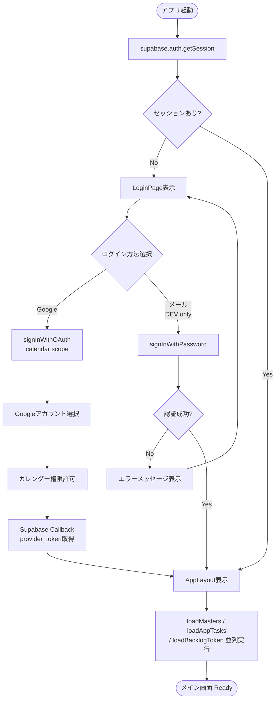

---

## 2. 今日タブ初期化フロー

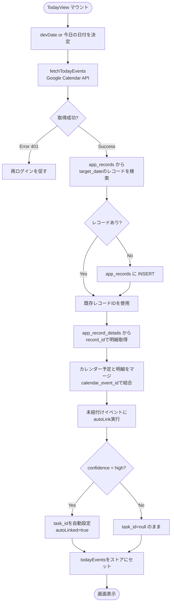

---

## 3. タイマー操作フロー

### 3-1. タイマー開始

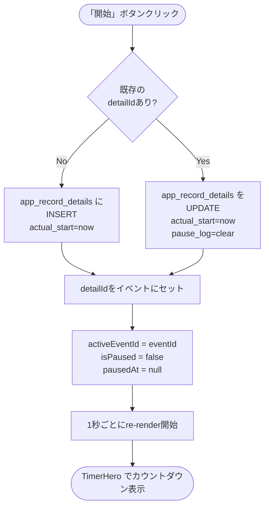

### 3-2. 一時停止・再開

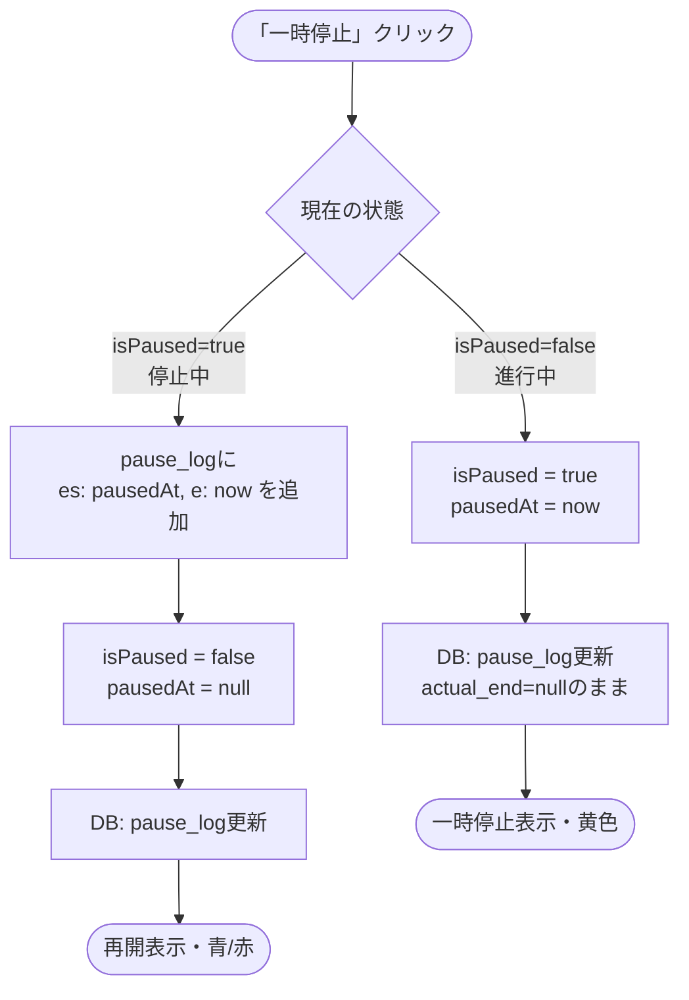

### 3-3. タイマー終了

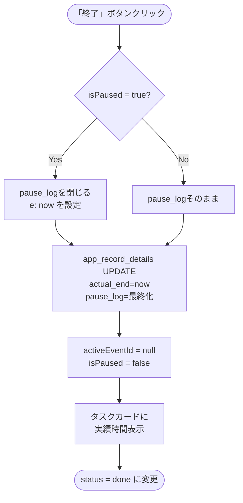

### 3-4. 手動時間調整

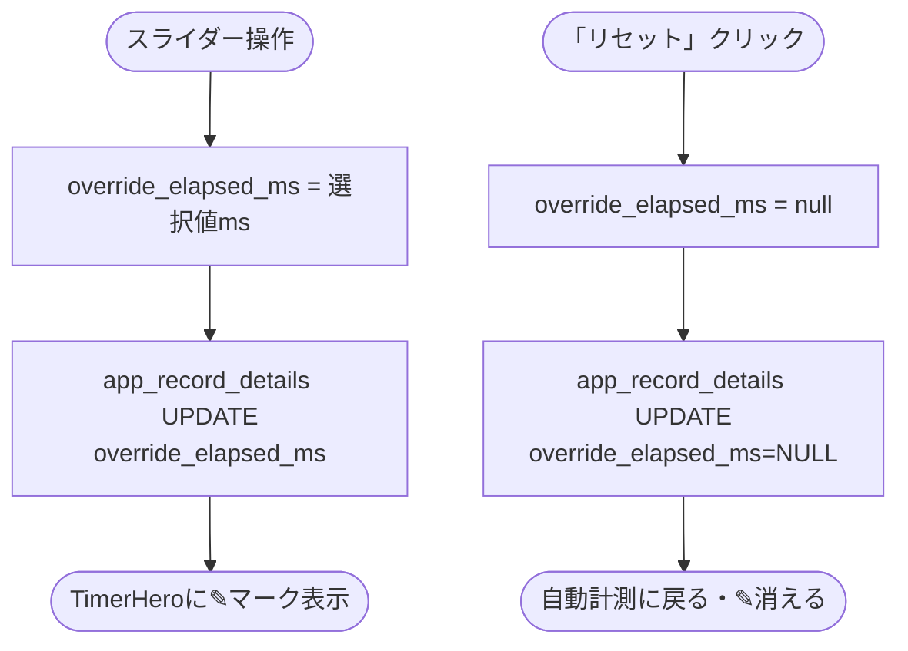

### 3-5. やり直し（Undo）

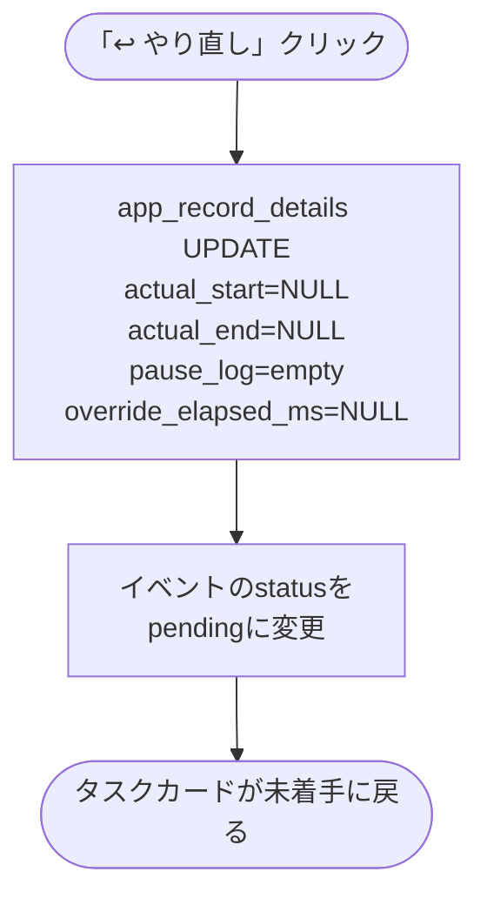

---

## 4. タスク紐付けフロー

### 4-1. LinkModal 表示

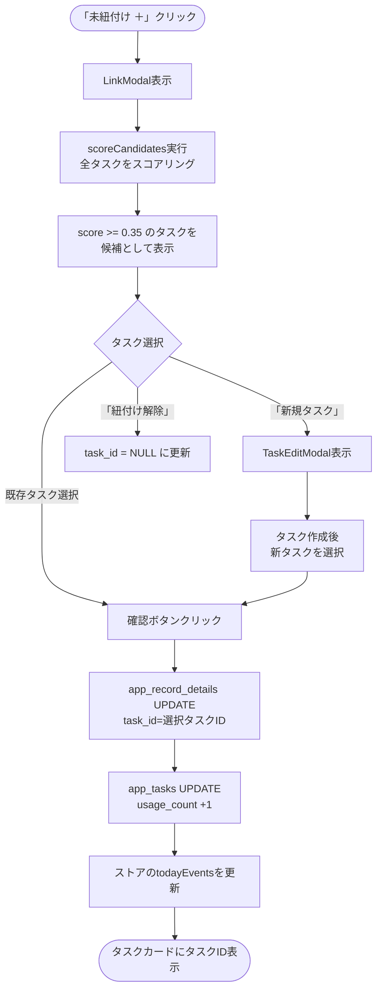

### 4-2. 自動タスク紐付けスコアリング

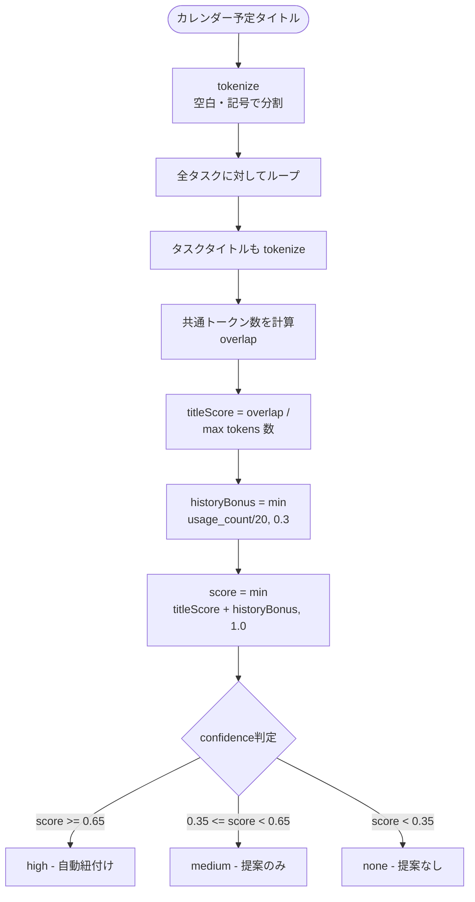

---

## 5. Backlog連携フロー

### 5-1. 初回連携

```mermaid
flowchart TD
    A([「Backlog」ボタンクリック]) --> B[BacklogModal表示\n設定ビュー]
    B --> C[スペースキー入力]
    C --> D[「連携する」クリック]
    D --> E[sessionStorageに\nspace_keyを保存]
    E --> F[getAuthUrl生成\nstateはrandom UUID]
    F --> G[Backlog OAuth画面\nへリダイレクト]
    G --> H[ユーザー：Backlogでログイン\n・アプリを許可]
    H --> I[/backlog-callback\nへリダイレクト\n?code=xxx&state=xxx]
    I --> J[BacklogCallback.jsx]
    J --> K[POST /api/backlog-token\ngrant_type=authorization_code]
    K --> L[Vercel Serverless\nBacklog OAuth APIへ中継]
    L --> M{トークン取得成功?}
    M -->|No| N[エラー表示]
    M -->|Yes| O[backlog_tokens に\nUpsert]
    O --> P[ストアに\nbacklogTokenをセット]
    P --> Q[/ へリダイレクト]
    Q --> R([Backlogボタンが緑に])
```

### 5-2. 課題インポート

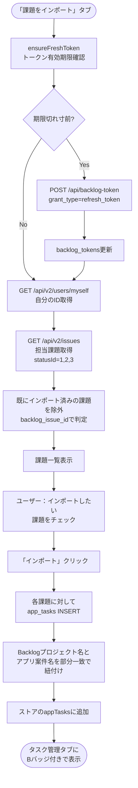

---

## 6. 集計データ取得フロー

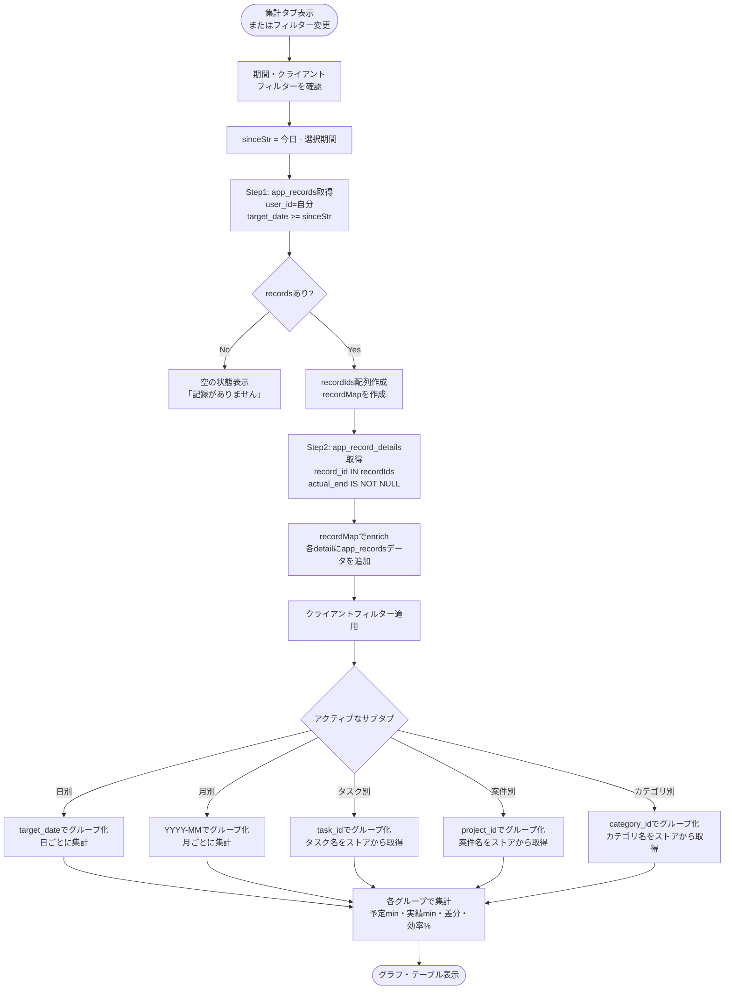
