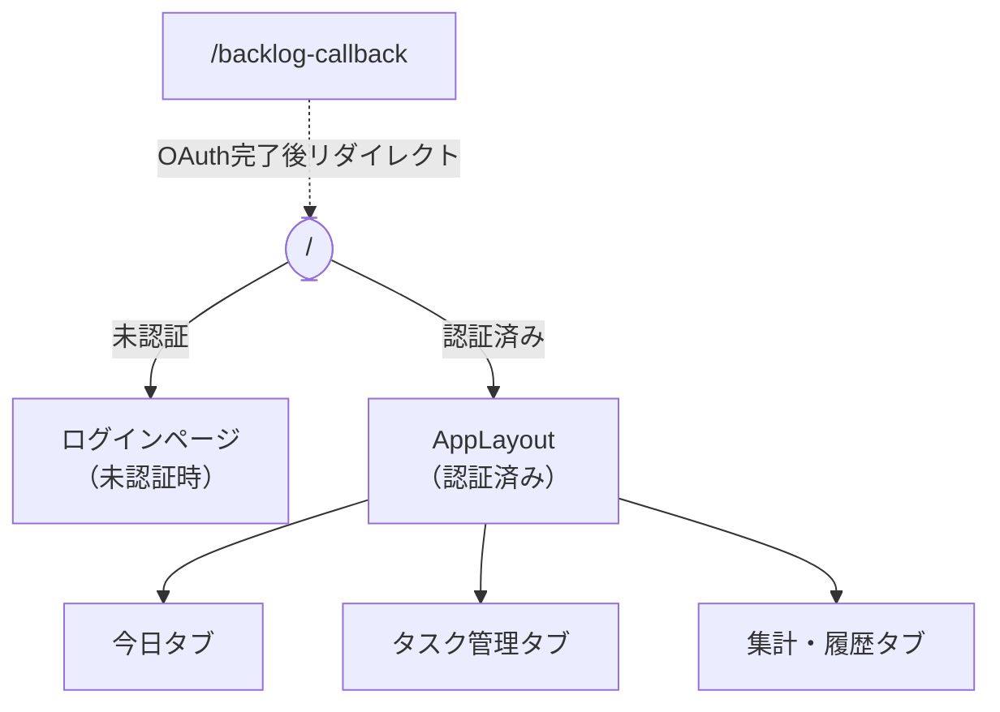

# タスクタイマー サイトマップ

**バージョン:** 0.1.0
**最終更新:** 2026-04-04

---

## URL構成

| URL | ページ | 認証 | 説明 |
|-----|--------|------|------|
| `/` | AppLayout（今日タブ） | 必要 | デフォルト表示 |
| `/#today` | 今日タブ | 必要 | タブ切り替えはURLハッシュなし（State管理） |
| `/#tasks` | タスク管理タブ | 必要 | 同上 |
| `/#analytics` | 集計・履歴タブ | 必要 | 同上 |
| `/backlog-callback` | Backlogコールバック | 任意 | BacklogのOAuth後のリダイレクト先 |
| `/*` (その他) | ログインページ | 不要 | 未認証時のリダイレクト先 |

> タブの切り替えはURLを変えずにReactのState（`activeTab`）で管理されています。

---

## 画面階層図



---

## 画面ツリー（コンポーネント構成）

```
App
├── LoginPage                          ← 未認証
│   ├── Googleログインボタン
│   └── [DEV] メールログインフォーム
│
└── AppLayout                          ← 認証済み
    │
    ├── ヘッダー
    │   ├── 日付表示（[DEV] 日付変更ピッカー）
    │   ├── アプリ名・DEVバッジ
    │   ├── Backlogボタン → BacklogModal
    │   │   ├── 設定ビュー
    │   │   │   ├── スペースキー入力
    │   │   │   ├── 連携ボタン
    │   │   │   └── 連携解除ボタン
    │   │   └── インポートビュー
    │   │       ├── 課題一覧（チェックボックス）
    │   │       └── インポートボタン
    │   └── ユーザー名・ログアウトボタン
    │
    ├── タブナビゲーション
    │   ├── 今日
    │   ├── タスク管理
    │   └── 集計・履歴
    │
    ├── 今日タブ（TodayView）           ← activeTab='today'
    │   ├── TimerHero（アクティブタスク表示）
    │   ├── TimerControls（操作ボタン）
    │   │   ├── 一時停止/再開ボタン
    │   │   ├── 終了ボタン
    │   │   ├── 時間調整スライダー
    │   │   └── リセットボタン
    │   ├── 「本日のスケジュール」ヘッダー（X/Y完了）
    │   └── TaskCard × N（カレンダー予定の数だけ）
    │       ├── 時刻・ステータスバッジ
    │       ├── 予定タイトル
    │       ├── タスク紐付けチップ → LinkModal
    │       │   ├── スコア付き候補一覧
    │       │   ├── タスク検索フィールド
    │       │   ├── 繰り返しフィルター
    │       │   └── 新規タスク作成 → TaskEditModal
    │       ├── クライアントチップ
    │       ├── 経過時間
    │       ├── 開始ボタン
    │       └── やり直しボタン（完了後）
    │
    ├── タスク管理タブ（TaskManagerView）  ← activeTab='tasks'
    │   ├── フィルターバー
    │   │   ├── クライアント選択
    │   │   ├── ステータス選択
    │   │   └── 繰り返しのみトグル
    │   ├── 「＋ 新規タスク」ボタン → TaskEditModal（新規）
    │   └── タスクテーブル
    │       └── 各行
    │           ├── [B]バッジ（Backlogタスクの場合）
    │           ├── タスクID・タイトル
    │           ├── クライアント・案件
    │           ├── カテゴリ1・カテゴリ2
    │           ├── ステータス・繰り返しバッジ
    │           ├── 開始日・期日
    │           ├── 編集ボタン → TaskEditModal（編集）
    │           └── 削除ボタン
    │
    └── 集計・履歴タブ（AnalyticsView）   ← activeTab='analytics'
        ├── サブタブ
        │   ├── 日別
        │   ├── 月別
        │   ├── タスク別
        │   ├── 案件別
        │   └── カテゴリ別
        ├── 期間フィルター（7/14/30/90/365日）
        ├── クライアントフィルター
        ├── サマリーカード（記録日数・総超過時間・全体効率）
        └── コンテンツ（タブにより変化）
            ├── 日別: 日付テーブル
            ├── 月別: 月テーブル
            ├── タスク別: FeedbackCardグリッド
            ├── 案件別: FeedbackCardグリッド
            └── カテゴリ別: 階層テーブル
```

---

## モーダル一覧

| モーダル | 起動元 | 説明 |
|---------|--------|------|
| LinkModal | タスクカードの紐付けチップ | カレンダー予定にタスクを紐付け |
| TaskEditModal（新規） | 「＋ 新規タスク」ボタン、LinkModalの「新規タスク」 | タスク新規作成 |
| TaskEditModal（編集） | タスクテーブルの「✏」ボタン | タスク編集 |
| BacklogModal | ヘッダーの「Backlog」ボタン | Backlog設定・インポート |

---

## ナビゲーション遷移

```
ログインページ
    ↓ (認証成功)
今日タブ ←──────────────────────────────────────────┐
    │                                                    │
    ├──[タブクリック]──► タスク管理タブ                  │
    │                       │                            │
    ├──[タブクリック]──► 集計・履歴タブ                  │
    │                                                    │
    ├──[Backlogボタン]──► BacklogModal                   │
    │                       └──[連携する]──► Backlog OAuth
    │                                              │
    │                                    /backlog-callback
    │                                              │
    └──────────────────────────────────────────────┘
                                         (連携完了後)
```
